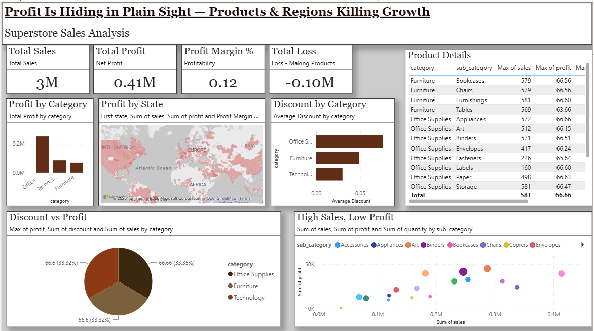

# Retail Profit Analysis Dashboard (Superstore)



**Profit is hiding in plain sight — identifying the products and regions killing growth.**

A Power BI dashboard analyzing Superstore sales data to uncover which products and regions generate high sales but low or negative profit, and how discounting drives losses.

## Key Metrics (from dashboard)
- **Total Sales**: 3M
- **Total Profit**: 0.41M
- **Profit Margin %**: 0.12 (12%)
- **Total Loss** (from loss-making products): -0.10M

## Key Insights

1. Several high-sales products are actually loss-making — high revenue does not mean high profit
2. Profit is split almost evenly across all three categories (Office Supplies, Furniture, Technology each ~33%), despite very different sales volumes per category
3. Office Supplies carries the highest average discount of the three categories, directly linked to its thinner margins
4. The "High Sales, Low Profit" scatter view highlights specific sub-categories (e.g. Bookcases, Tables) that generate strong sales but contribute disproportionately little profit — strong candidates for repricing
5. A handful of states contribute significant revenue but generate minimal profit, visible on the geographic profit map

## Contents

- `superstore-profit-dashboard.pbix` — Power BI report file (open in Power BI Desktop)
- `retail-profit-dashboard.png` — dashboard screenshot
- `cleaned_superstore.xlsx` — cleaned dataset used to build the dashboard
- `dax-measures.txt` — all DAX measures used in the report
- `summary_changes.md` — data cleaning steps and assumptions

## How to View

Download `superstore-profit-dashboard.pbix` and open it in [Power BI Desktop](https://www.microsoft.com/en-us/power-platform/products/power-bi/downloads) (free). If you don't have Power BI installed, see the DAX measures and cleaning summary below for the underlying logic.

## DAX Measures (Highlights)

Full list in `dax-measures.txt`. Core measures:

```dax
Total Sales = SUM('Superstore'[sales])
Total Profit = SUM('Superstore'[profit])
Profit Margin % = DIVIDE([Total Profit], [Total Sales], 0)

Loss Amount =
SUMX(
    FILTER('Superstore', 'Superstore'[profit] < 0),
    'Superstore'[profit]
)

Avg Discount - Loss =
CALCULATE(AVERAGE('Superstore'[discount]), 'Superstore'[profit] < 0)

Avg Discount - Profit =
CALCULATE(AVERAGE('Superstore'[discount]), 'Superstore'[profit] >= 0)
```

These measures power the comparison between discount levels on profitable vs. loss-making orders — the core insight of the dashboard.

## Data Cleaning

See `summary_changes.md` for full details. Summary: fixed data types across all date/numeric columns, standardized text casing in state/city/sub-category fields, removed unused columns (row_id, weeknum, market2), and added derived Profit Margin % and Loss Amount columns via DAX.
